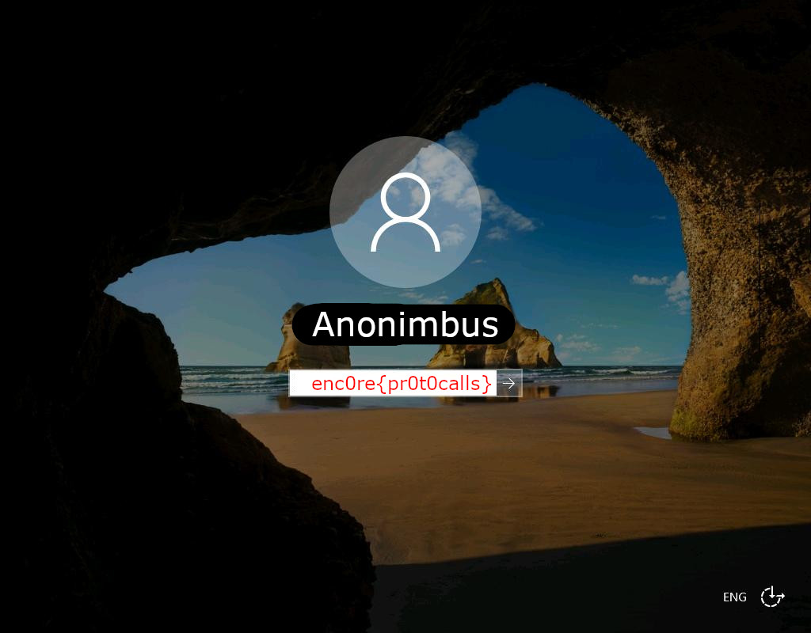

# Ports
good luck ;)<br>
4.224.22.66<br>
password:anonimbus

## Flag
```
enc0re{pr0t0calls}
```

## Solution
* By opening the ip in browser which by default takes it as port 80, we can only see a text which says `anonimbus do a little trolling ;)`
* After scanning the ip for open ports, we see that 28 ports are open and one port has the flag
* All services have default username and password as anonimbus
	* for example admin, ftp, root, guest, administrator etc
	* You can connect to ftp using `ftp 4.224.22.66` or ssh using `ssh root@4.224.22.66 -p 24`
* The correct port is 3389 which is RDP. You can connect to it using `Remote Desktop Connection` on windows or `Remmina` on linux/macos.
* The username is administrator and password is anonimbus or you could have just put anything in the username and nothing in password which still would have connected you to the RDP server.


